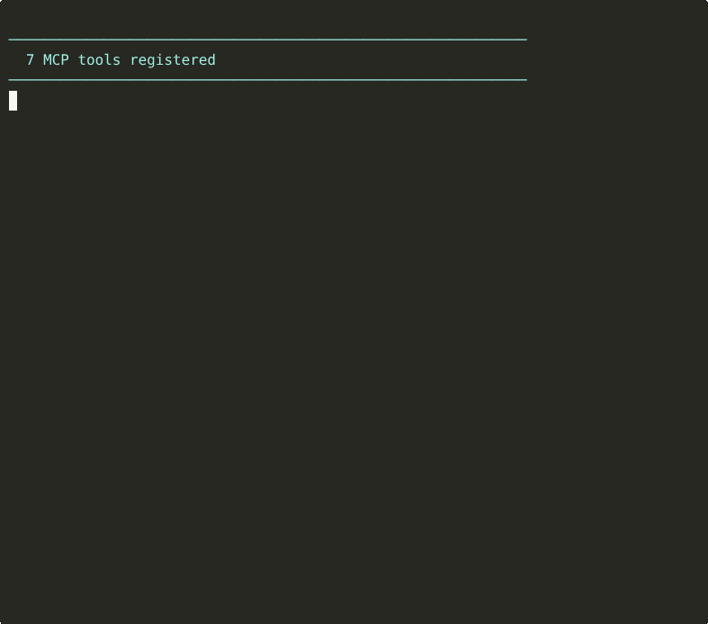

# reflect

[](https://crates.io/crates/reflect-mcp)
[](LICENSE)

Self-correction engine for AI coding agents. An MCP server that implements the [Reflexion](https://arxiv.org/abs/2303.11366) pattern — turning agent failures into persistent, searchable lessons that prevent the same mistakes across sessions.

```bash
cargo install reflect-mcp
```

<p align="center">
  
</p>

## The Problem

AI coding agents make mistakes, get corrected, and then make the **exact same mistakes** in the next session. Context resets wipe everything. There's no memory of what went wrong, what was learned, or which error patterns keep recurring.

## How reflect Solves It

reflect closes the loop from the Reflexion paper (Shinn et al., 2023):

```
generate code → evaluate → critique → store lesson → recall next time → retry smarter
```

Unlike the original paper which uses LLM self-reflection, reflect takes a **hybrid approach**:
- **Deterministic pattern extraction** — regex-based classification of error messages into pattern slugs (e.g., `rust-unwrap-on-parse`, `rust-index-oob`), no LLM needed
- **Agent-provided critique** — the calling agent writes the reasoning and lesson text, reflect handles structuring, deduplication, storage, and retrieval
- **Persistent cross-session memory** — SQLite with FTS5 full-text search, so lessons survive context resets

This means reflect is **fast, deterministic, and has zero LLM cost** for the pattern matching layer, while still benefiting from the agent's reasoning for critique quality.

## What Makes reflect Different

| Feature | reflect | Plain memory/RAG | LLM self-reflection |
|---|---|---|---|
| Structured error signals | Parses test output into typed signals | Stores raw text | N/A |
| Pattern tracking | Counts occurrences, detects trends | No pattern awareness | No persistence |
| Confidence scoring | Laplace-smoothed validation/contradiction | No scoring | Per-session only |
| Deduplication | Normalized Levenshtein similarity | Stores duplicates | N/A |
| Cross-session recall | FTS5 search by task + tags | Keyword/embedding search | Lost on reset |
| Cost | Zero (deterministic) | Embedding API calls | LLM calls per reflection |

## Architecture

4-crate Rust workspace:

```
reflect/
├── crates/
│   ├── reflect-core/    # Types, Storage trait, pattern engine, dedup
│   ├── reflect-eval/    # Test output parsers (cargo_test, pytest, eslint, tsc), command runner
│   ├── reflect-store/   # SQLite + FTS5 (default), optional ctxgraph backend
│   └── reflect-mcp/     # MCP server (rmcp v1.3), 7 tools, config
├── tests/fixtures/      # Captured test outputs for parser testing
├── Cargo.toml           # Workspace root
└── Cargo.lock
```

## MCP Tools

| Tool | Purpose |
|---|---|
| `evaluate_output` | Run evaluators (cargo test, pytest, eslint, tsc, custom) and get structured pass/fail signals |
| `reflect_on_output` | Store a reflection with pattern extraction and dedup checking |
| `store_reflection` | Store a standalone lesson without evaluation signals |
| `recall_reflections` | Search past lessons by task description and tags (FTS5) |
| `get_error_patterns` | List recurring error patterns with frequency and trend data |
| `get_reflection_stats` | Aggregated stats: totals, outcomes, top patterns, top tags |
| `forget_reflection` | Delete a specific reflection by ID |

## Agent Workflow

**Before starting a task:**
```
Agent → recall_reflections("implement date parser", tags: ["rust"])
     ← 3 past lessons about date parsing, including "always handle timezone-naive inputs"
     ← patterns_to_watch: rust-unwrap-on-parse (seen 7 times)
```

**After a failure:**
```
Agent → evaluate_output(evaluators: ["cargo_test"], working_dir: "/my/project")
     ← signals: [{evaluator: "cargo_test", passed: false, errors: [{message: "called Result::unwrap() on Err"}]}]

Agent → reflect_on_output(
          task: "parse user date input",
          draft: "input.parse::<NaiveDate>().unwrap()",
          signals: <from above>,
          critique: "Used unwrap on user input that can fail",
          lesson: "Always use Result handling for parse operations on untrusted input",
          outcome: "failure",
          tags: ["rust", "error-handling"]
        )
     ← {reflection_id: "...", pattern_id: "rust-unwrap-on-parse", pattern_occurrences: 8, is_duplicate: false}
```

## Installation

### Build from source

```bash
git clone https://github.com/rohansx/reflect.git
cd reflect
cargo build --release
```

Binary: `target/release/reflect-mcp`

### Add to Claude Code

Add to `~/.claude.json`:

```json
{
  "mcpServers": {
    "reflect": {
      "type": "stdio",
      "command": "/path/to/reflect-mcp",
      "args": [],
      "env": {}
    }
  }
}
```

### Add to Claude Desktop

Add to `claude_desktop_config.json`:

```json
{
  "mcpServers": {
    "reflect": {
      "command": "/path/to/reflect-mcp",
      "args": []
    }
  }
}
```

## Configuration

reflect works with zero configuration. Optionally create `reflect.toml` in your project root or `~/.config/reflect/reflect.toml`:

```toml
[storage]
path = ".reflect/reflect.db"    # default
# backend = "sqlite"            # default
# backend = "ctxgraph"          # requires --features ctxgraph

[eval.cargo_test]
command = "cargo test"
timeout_secs = 60

[eval.pytest]
command = "pytest --tb=short -q"
timeout_secs = 120

[eval.eslint]
command = "npx eslint . --format stylish"
timeout_secs = 60

[eval.tsc]
command = "npx tsc --noEmit"
timeout_secs = 60

# Custom evaluator — any command that returns exit 0 for pass
[eval.mypy]
command = "mypy src/"
timeout_secs = 90

[recall]
default_limit = 5
dedup_threshold = 0.75          # normalized Levenshtein similarity

# Custom pattern rules
[[patterns]]
evaluator = "cargo_test"
regex = "connection refused"
id = "db-connection-refused"
category = "infrastructure"
```

Environment variables:
- `REFLECT_CONFIG` — path to config file (overrides search)
- `REFLECT_DB` — path to SQLite database (overrides config)

## Key Design Decisions

**Why regex pattern matching instead of LLM classification?**
Deterministic, zero-cost, reproducible. Error messages follow predictable formats. Custom rules in TOML for project-specific patterns.

**Why SQLite + FTS5 as default instead of vector embeddings?**
No external dependencies, instant startup, full-text search is good enough for task-description similarity. For better recall, enable the optional ctxgraph backend which adds 384-dim embedding search with RRF ranking.

**Why the agent provides critique text?**
The agent has full context (code, intent, constraints). reflect adds structure (timestamps, confidence, patterns, dedup) — each does what it's best at.

**Why UUIDv7?**
Time-ordered, sortable, globally unique. No sequence coordination needed.

**Why Laplace smoothing for confidence?**
`0.5 + (validations - contradictions) / (validations + contradictions + 2)` — starts neutral (0.5), converges with evidence, never reaches 0 or 1 with finite data.

## ctxgraph Backend (Optional)

For embedding-based semantic search and cross-project reflection retrieval, build with the ctxgraph feature:

```bash
cargo build --release --features ctxgraph
```

Then set the backend in `reflect.toml`:

```toml
[storage]
backend = "ctxgraph"
path = ".reflect/reflect.db"
```

This uses [ctxgraph](https://github.com/rohansx/ctxgraph)'s fused search (FTS5 + 384-dim AllMiniLML6V2 embeddings with RRF ranking) for more accurate recall. Reflections are stored as ctxgraph Episodes with graph-structured pattern tracking via Entities and Edges.

## Roadmap

- **Phase 1** (done): Core loop — cargo_test parser, SQLite+FTS5, 7 MCP tools, pattern engine, dedup
- **Phase 2** (done): Multi-language — pytest, eslint, tsc parsers, configurable dedup, pattern rules for Python/JS/TS
- **Phase 3** (done): Semantic search via [ctxgraph](https://github.com/rohansx/ctxgraph) as optional storage backend (`--features ctxgraph`)
- **Phase 4**: Distribution — crates.io, Homebrew, documentation site

## References

- Shinn, N., Cassano, F., Gopinath, A., Narasimhan, K., & Yao, S. (2023). [Reflexion: Language Agents with Verbal Reinforcement Learning](https://arxiv.org/abs/2303.11366). NeurIPS 2023.
- [Model Context Protocol](https://modelcontextprotocol.io/) — the transport layer
- [rmcp](https://crates.io/crates/rmcp) — Rust MCP SDK

## License

MIT
